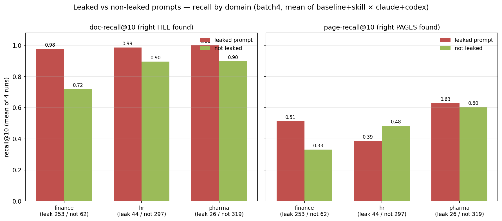

# batch4 prompt leakage analysis

**Question:** how many prompts reference a file/source that directly correlates to the
expected answer's gold document? (answer-location leakage)

**Scope:** the 1001 corpus-level queries we evaluated (3 domains; each base question
appears as a `:domain` and a `:cross_domain` variant). All 1001 have gold
`relevant_pages`.

## Findings

| leakage type | count | % of 1001 |
|---|---|---|
| **Explicit `.pdf` filename in prompt matching a gold doc** | 0 | **0.0%** |
| **Source entity/title name in prompt matching a gold doc** (token heuristic) | 267 | 26.7% |
| &nbsp;&nbsp;— exact distinctive-name phrase (high precision) | 158 | 15.8% |
| &nbsp;&nbsp;— ≥70% distinctive-token overlap | 109 | 10.9% |
| **+ alias / abbreviation / topic matches (final, all domains)** | **323** | **32.3%** |

By domain (entity/title leakage):

| domain | flagged / total | % |
|---|---|---|
| vidore_v3_finance_en | 233 / 315 | **74%** |
| vidore_v3_hr | 24 / 341 | 7% |
| vidore_v3_pharmaceuticals | 10 / 345 | 3% |

## What this means

- **No prompt names a literal `.pdf`** — all 1001 use folder globs
  (`test-data/.../pdfs/*.pdf`), i.e. nominally corpus-wide search. So there's zero
  filename-string leakage.
- **But 26.7% name the source document's entity/title**, which in these corpora maps
  1:1 to a file — e.g. *"…net loan charge-offs for **Wells Fargo**…"* → `wells_fargo_2024`,
  *"…**Bank of America** Corporation…"* → `bank_of_america_2024`. Even though the prompt
  says "search all PDFs," naming the company/report tells you exactly which file holds
  the answer, trivializing retrieval.
- **Concentrated in finance** because that corpus is one filing per company and the
  questions name the company; HR/pharma docs are topical, so fewer questions name the
  exact source. (Token heuristic by domain: finance 74% / hr 7% / pharma 3%; after the
  alias/topic expansion below: **finance 80% / hr 13% / pharma 8%**.)

## Method (heuristic)

For each query, take the gold `relevant_pages` doc_id(s), reduce to distinctive tokens
(drop years, alphanumeric codes like `KE0125029ENN`, and generic words like
*report/annual/presentation*), and flag if those tokens appear in the prompt as a
contiguous phrase, or with ≥70% token overlap (≥2 tokens). `phrase` matches are
high-precision; `overlap` matches were spot-checked (e.g. `bank`+`america` →
`bank_of_america_2024`). It will miss paraphrased entity references (e.g. "the big
custody bank") and could over-flag a doc whose distinctive tokens are common — treat
26.7% as a well-calibrated lower-ish bound on entity/title leakage.

## Alias / topic detection (paraphrase cases the token heuristic misses) — all domains

The token heuristic misses entity references that don't share the doc's tokens
(abbreviations, partial titles). Adding a curated alias/topic map across all three
domains catches **56 more** cases → **323 / 1001 = 32.3%**.

| domain | alias/topic patterns added |
|---|---|
| finance (6 companies) | bank of america / **bofa** / merrill · citigroup / **citi** · **jpmorgan** / jp morgan / jpm / chase · goldman · morgan stanley · wells fargo / wfc |
| HR (14 reports) | **intra-EU labour mobility** · **public employment services** · future-oriented occupations · future of work · labour market transitions / skills investment · **posting of / posted workers** · joint employment report · **domestic workers** · wage developments · undeclared (care) work · demographic perspective · working conditions / career development · employment and social developments |
| pharma (unique-topic only) | (antimicrobial/antibiotic/drug) resistance → `drug_resistance_book` · **dscsa** → DSCSA webinar · medication error → DMEPA slides · vaccine → medicine_vaccine_book |

Incremental hits validate cleanly — e.g. finance *"…**BofA** Finance LLC…"*,
*"…**JPMorgan**'s CET1…"*; HR *"…decrease in **posted workers** in Germany…"* →
`posting_of_workers`, *"…modernize **public employment services**…"* → its report. Pharma
aliasing is deliberately narrow (most pharma docs are person/event-named presentations
whose topics span several files, so a topic word isn't a unique file identifier).

**By-domain leakage rate (final, alias-augmented):**

| domain | flagged / total | % |
|---|---|---|
| finance | 253 / 315 | **80%** |
| hr | 44 / 341 | 13% |
| pharma | 26 / 345 | 8% |

## Cross-reference: does leakage correlate with higher recall?

**Overall (uncontrolled)** — leaked vs non-leaked recall@10 is flat/slightly negative
(baseline-claude 0.46 vs 0.48; skill-claude 0.59 vs 0.57). This is **confounded**:
leakage is ~80% finance, and finance has lower page-recall (huge multi-hundred-page
10-Ks), so the leaked set is finance-heavy and the non-leaked set HR/pharma-heavy.
Controlling by domain separates the two effects.

**Document-level — did the run pick the right *file*? (`doc-recall@10`, leaked vs not):**

| run | finance L / N | hr L / N | pharma L / N |
|---|---|---|---|
| baseline-claude | 0.98 / 0.73 | 0.96 / 0.88 | 1.00 / 0.85 |
| baseline-codex | 0.97 / 0.74 | 0.99 / 0.91 | 1.00 / 0.89 |
| skill-claude | 0.98 / 0.69 | 1.00 / 0.89 | 1.00 / 0.94 |
| skill-codex | 0.98 / 0.72 | 1.00 / 0.91 | 1.00 / 0.91 |

→ **In every domain and every run, leaked prompts find the correct source file more
often** — ~0.96–1.00 vs ~0.69–0.94. This is the direct, unambiguous leakage effect:
naming the source identifies the file.

**Page-level (`page-recall@10`, leaked vs not):**

| run | finance L / N | hr L / N | pharma L / N |
|---|---|---|---|
| baseline-claude | 0.452 / 0.290 | 0.341 / 0.430 | 0.686 / 0.571 |
| baseline-codex | 0.479 / 0.362 | 0.363 / 0.478 | 0.651 / 0.581 |
| skill-claude | 0.607 / 0.330 | 0.458 / 0.539 | 0.547 / 0.646 |
| skill-codex | 0.517 / 0.339 | 0.385 / 0.490 | 0.630 / 0.615 |

→ **Page-recall lift is large in finance (+0.12 to +0.28) but flat/negative in HR**
(leaked < not) and mixed in pharma. (Leaked counts: finance 253, hr 44, pharma 26 — HR/
pharma samples are small.)

**Chart (mean of the 4 runs):**

Left = doc-recall@10 (right *file* found): leaked clears non-leaked in every domain.
Right = page-recall@10 (right *pages*): leaked wins big in finance, ties in pharma, and
trails in HR — knowing the document doesn't pin the page in large topical reports.

**Conclusion:** Naming the source entity is real leakage — it reliably trivializes
**which file** to open (doc-recall ~0.97–1.00 vs ~0.69–0.94 across *all* domains). It
converts to a big **page-recall** gain in **finance** (one filing per company → naming
the company pins both the file and a concentrated answer region), but **not in HR/pharma**,
where the gold docs are large topical reports: knowing the document doesn't pin the page,
so page-recall@10 doesn't improve even though doc selection does. The naive overall
comparison hid the finance effect behind the finance/non-finance domain confound.

## Artifacts
- `leakage_batch4.json` — `query_ids` (323, final) + per-query `detail`
  (`gold_doc`, `match`, `matched_tokens`); `extended` (count/pct/by_domain/incremental);
  `recall_xref` (overall), `recall_xref_finance`, and `recall_xref_by_domain`
  (page + doc recall, leaked vs not, per domain per run).
- `leaked_vs_not_recall_batch4.png` — the chart above (doc- & page-recall@10, leaked vs
  not, by domain, mean of the 4 runs).
