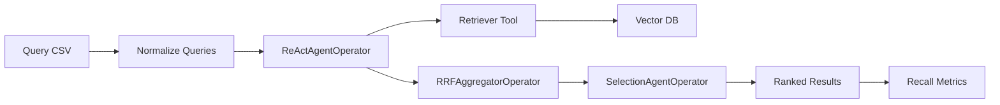

# Agentic Retrieval Mode

Agentic retrieval mode is a retrieval strategy for the main NeMo Retriever
pipeline. It is not a separate evaluation benchmark. The evaluation mode still
answers "how do we score results?", while retrieval mode answers "how do we
produce ranked results?".

The first integration supports:

```bash
--evaluation-mode recall --retrieval-mode agentic
```

In this mode, the pipeline ingests documents and uploads them to the configured
vector database exactly as it does today. The difference starts at evaluation
time: instead of one standard dense retrieval pass, an LLM-driven graph
retrieval pipeline searches the same vector database and produces ranked
results that are scored with recall-style metrics.

## Graph Pipeline

The agentic retriever composes the existing graph operators:



`ReActAgentOperator` runs an LLM-driven ReAct loop per query. The agent can
think, issue retrieval subqueries, inspect retrieved candidates, and decide
when it has enough evidence.

`RRFAggregatorOperator` combines candidates from multiple retrieval steps using
reciprocal rank fusion. This gives more weight to documents that appear near
the top across multiple search attempts.

`SelectionAgentOperator` runs a final LLM-based selection pass over the fused
candidate set and emits the ranked document IDs used for scoring.

## CLI Integration

The main CLI adds a retrieval strategy option:

```bash
--retrieval-mode standard|agentic
```

`--evaluation-mode` remains evaluation-focused:

```bash
--evaluation-mode recall|beir|qa
```

Supported combinations in the first integration:

- `--evaluation-mode=recall --retrieval-mode=standard`
- `--evaluation-mode=recall --retrieval-mode=agentic`
- `--evaluation-mode=qa --retrieval-mode=standard`

Unsupported initially:

- `--evaluation-mode=qa --retrieval-mode=agentic`
- BEIR through the generic pipeline path remains unchanged and unavailable, as
  it is in the existing pipeline.

## Agentic Options

`--agentic-llm-model` sets the chat model used by both `ReActAgentOperator` and
`SelectionAgentOperator`. It is required when `--retrieval-mode=agentic`.

`--agentic-invoke-url` optionally sets the OpenAI-compatible chat completions
endpoint used by the agent operators. If omitted, the operators use their
default endpoint.

`--agentic-react-max-steps` controls the maximum ReAct loop iterations per
query. The default is `10`.

## Wrapped Standard Retrieval

Every agent `retrieve` tool call delegates to the existing
`nemo_retriever.retriever.Retriever`. That means agentic mode searches the same
vector database populated by ingestion and reuses the same retrieval settings
where possible.

Existing options reused by the wrapped retriever:

- `--api-key`: authentication for agentic LLM calls and remote services unless
  a more specific key is provided.
- `--embed-model-name`, `--embed-invoke-url`, `--local-query-embed-backend`,
  `--local-hf-batch-size`: query embedding configuration.
- `--reranker`, `--reranker-model-name`, `--reranker-invoke-url`,
  `--reranker-api-key`, `--local-reranker-backend`: optional reranking inside
  the wrapped retriever.

The first integration intentionally keeps the lower-level agentic retrieval
parameters fixed:

- retriever top-k: `10`
- target top-k: `10`
- selection top-k: `10`
- query concurrency: `1`
- text truncation: `500`
- max tokens: provider default
- parallel tool calls: disabled

## Examples

Local in-process run:

```bash
retriever pipeline run ./data/bo767 \
  --run-mode inprocess \
  --evaluation-mode recall \
  --retrieval-mode agentic \
  --query-csv ./data/bo767_query_gt.csv \
  --agentic-llm-model meta/llama-3.3-70b-instruct \
  --api-key os.environ/NVIDIA_API_KEY
```

Batch run with remote embedding and agent endpoints:

```bash
retriever pipeline run ./data/bo767 \
  --run-mode batch \
  --evaluation-mode recall \
  --retrieval-mode agentic \
  --query-csv ./data/bo767_query_gt.csv \
  --embed-invoke-url http://localhost:8000/v1 \
  --agentic-invoke-url http://localhost:9000/v1/chat/completions \
  --agentic-llm-model meta/llama-3.3-70b-instruct \
  --agentic-react-max-steps 5 \
  --api-key os.environ/NVIDIA_API_KEY
```
